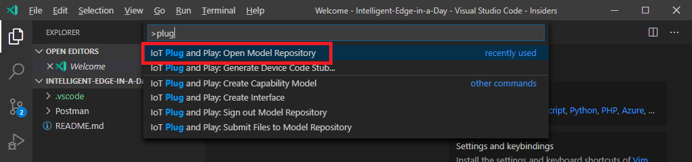
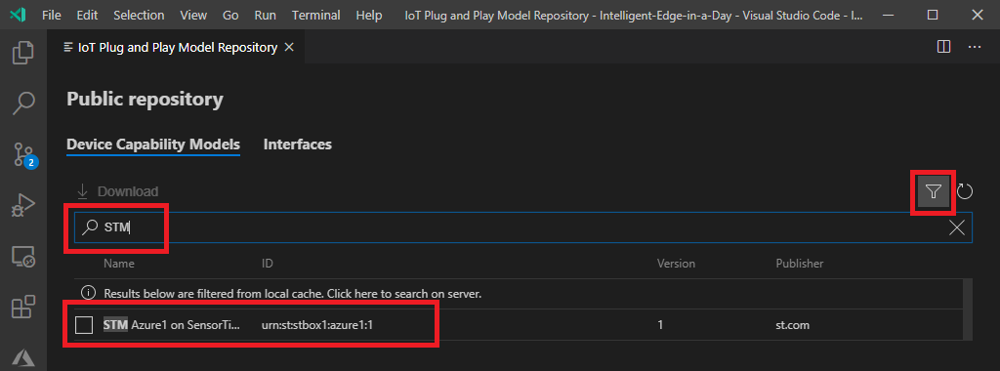
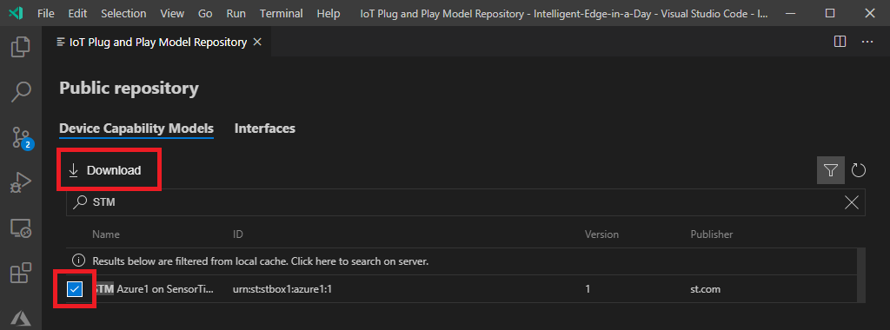
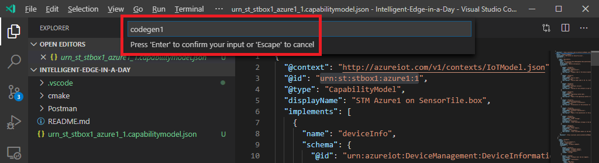
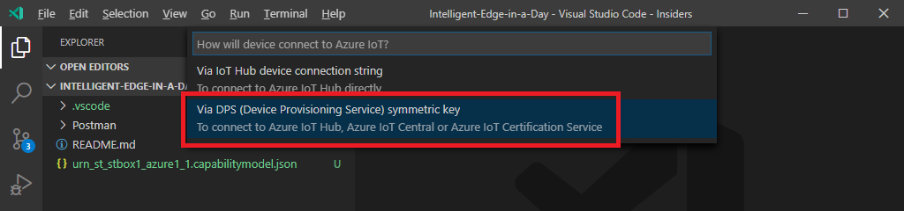

# IoT Plug and Play Code Generation

> [!IMPORTANT] **On your development machine with local folder**  
> If you are connected to RP4, please disconnect or start a new VSCode window

IoT Plug and Play introduces code generation from Device Capability Mode (DCM).

DCM file is a json file describes a device, functions, type of data, format and so forth.  DCM is based on the industry standard Digital Twin Definition Language.

VSCode + Azure IoT Workbench can generate code stub (template) code from DCM.

The code stub contains basics such as :

- Provisioning
- Connection to Azure IoT Hub or IoT Central
- Send messages
- Receive commands
- Send and receive Device Twin

However, the code stub does not include device specific code such as :

- Read sensor data from sensor hardware
- Read device information such as BIOS/Firmware version

## Download Device Capability Model

1. Open `C:\Repo\Intelligent-Edge-in-a-Day` folder in VSCode  
    [File] -> [Open Folder...], then select `C:\Repo\Intelligent-Edge-in-a-Day`
1. In VSCode, open `Command Palette` by pressing `F1` key  
1. Type `plug` in the command palette to see list of IoT Plug and Play commands
1. Select `IoT Plug and Play : Open Model Repository`

      

1. Select `Public repository`  

      

1. Scroll down or use filter to find `STM Azure1 on SensorTile.Box` from the list

      

1. Select `STM Azure1 on SensorTile.Box` and click `Download`

      

1. Confirm a json file `urn_st_stbox1_azure1_1.capabilitymodel.json` is downloaded to local folder `C:\Repo\Intelligent-Edge-in-a-Day`  

    You can close Model Repository Window

      

## Generate Code from Device Capability Model

Using the DCM file we just downloaded, let's generate code stub

1. Open `Command Palette` then select `IoT Plug and Play: Generate Device Code Stub...`  

    

1. Select `urn_st_stbox1_azure1_1.capabilitymodel.json`

    

1. Enter `codegen1` for the project name, then press `Enter` key  

    You may select your own project name.  This HOL assumes you are using `codegen1` (Case Sensitive) as a project name

    

1. Select `ANSI C`

    

1. Select `Via DPS (Device Provisioning Service) symmetric key`

    

1. Select `CMake Project on Linux`

    

1. Select `Via Source Code`

    

You should see a new VSCode Insiders window with generated code stub.

## Complete

Now you have source code with IoT Plug and Play enabled.  The code stub is a template with basic functionality such as connection, send telemetry, receive command, and report properties.

The code stub does not include device specific code, meaning it does not know how to read sensor data.

We will add device specific code later.

[Next Section](IoT-PnP-Compile.md)

[Go back to top page](readme.md)
