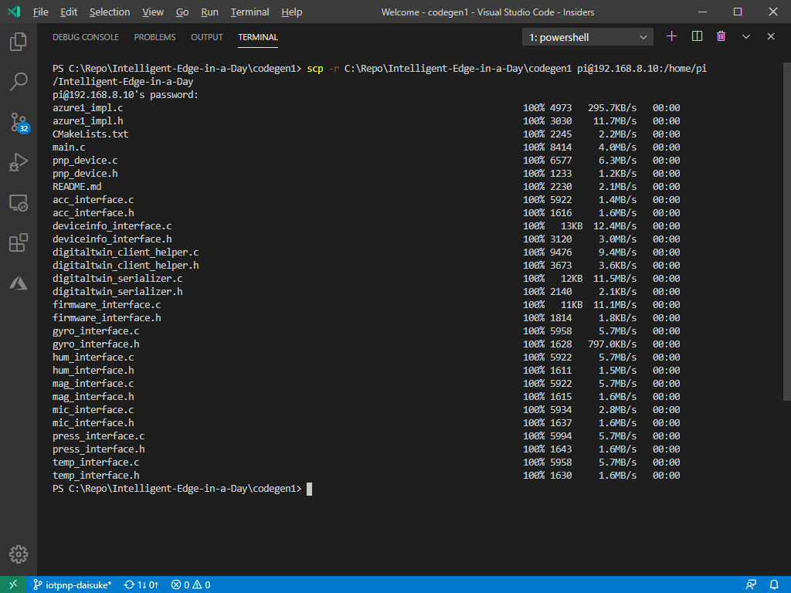
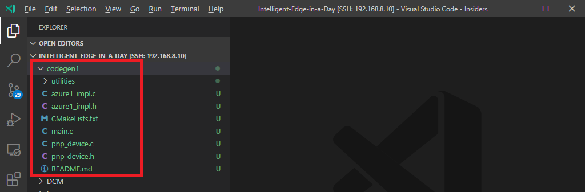
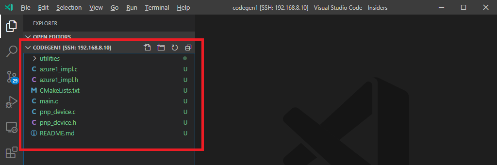
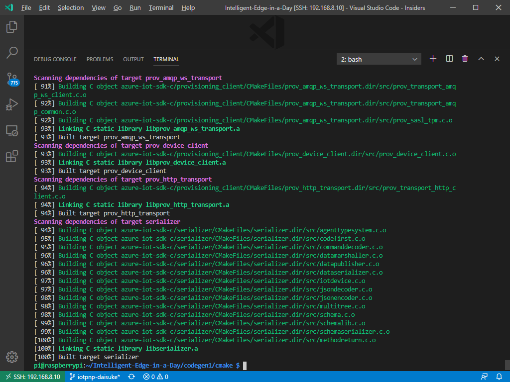

# Compile Code Stub

Now we have source code that we can compile and run.
In this section, we will :

- Copy source code to Raspberry Pi 4
- Compile source code

## Copy Code Stub to RP4

> [!IMPORTANT] **On your development machine with local folder**  
> If you are connected to RP4, please disconnect or start a new VSCode window

You can set up your development machine to cross compile for Raspberry Pi 4, however, in this lab, we will copy source code and compile on Raspberry Pi 4.

1. Open Terminal window in VSCode  

    

1. In the Terminal window, run scp to copy code stub to RP4 with :

    - Make sure to replace **[IP Address of your RP4]** with IP Address of RP4
    - This command will copy C:\Repo\Intelligent-Edge-in-a-Day\codegen1 on development machine to /home/pi/Intelligent-Edge-in-a-Day/codegen1 on RP4  
  
    ```bash
    scp -r C:\Repo\Intelligent-Edge-in-a-Day\codegen1 pi@[IP Address of your RP4]:/home/pi/Intelligent-Edge-in-a-Day  
    ```

    

## Compile Code Stub

> [!IMPORTANT] **On your development machine with remote folder**  
> If you are not connected to RP4, please connect now, or switch to VSCode with remote connection

1. Connected to RP4 in VSCode
1. Open folder remote folder `/home/pi/Intelligent-Edge-in-a-Day/codegen1`  

    [File] -> [Open Folder...], then select `/home/pi/Intelligent-Edge-in-a-Day/codegen1`

    You should see `codegen1` folder with source code

    

    If you do not see the folder, click `Refresh` button  

    

1. In VSCode Insiders terminal window, configure CMake and build code stub with :

    > [!NOTE]  
    > This may take 3~5 minutes  
    > To save time, Azure IoT C SDK is already cloned to RP4

  ```bash
  cd /home/pi/Intelligent-Edge-in-a-Day/codegen1
  mv /home/pi/Intelligent-Edge-in-a-Day/azure-iot-sdk-c .
  # skip clone to save time.  
  # If you are using your own environment, please clone SDK
  # git clone https://github.com/Azure/azure-iot-sdk-c --recursive -b public-preview
  mkdir cmake
  cd cmake
  cmake .. -Duse_prov_client=ON -Dhsm_type_symm_key:BOOL=ON -Dskip_samples=ON -Dbuild_service_client=OFF
  cmake --build . --config Release
  
  ```

1. Make sure there is no error

    

1. Run the application

    Verify the application binary is generated and executable

    > [!NOTE]  
    > Error is expected at this point since this application expects command line parameters

  ```bash
  pi@raspberrypi:~/Intelligent-Edge-in-a-Day/codegen1/cmake $ ./codegen1 
Error: Time:Sun Feb 23 20:35:18 2020 File:/home/pi/Intelligent-Edge-in-a-Day/codegen1/main.c Func:main Line:222 USAGE: codegen1 [Device ID] [DPS ID Scope] [DPS symmetric key]
pi@raspberrypi:~/Intelligent-Edge-in-a-Day/codegen1/cmake

   ```

## Complete

The code stub executable is ready to run.  Let's connect to IoT Central.

[Next Section](IoT-PnP-DeviceIdentity.md)

[Go back to top page](readme.md)

## Reference

[Manually create device identity in IoT Central](IoT-PnP-DeviceIdentity-Manual.md)