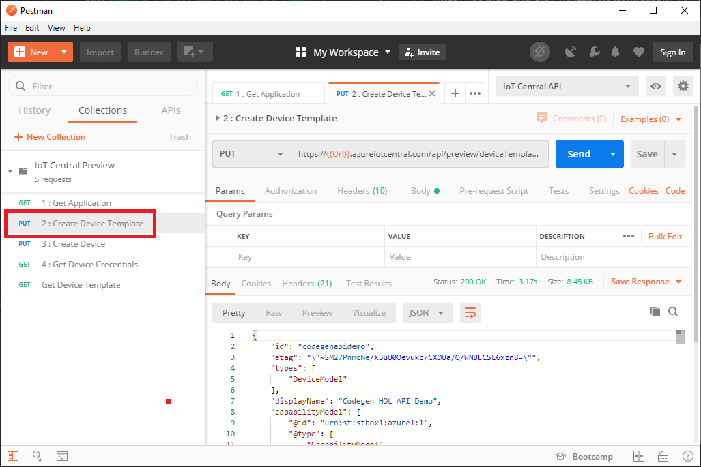
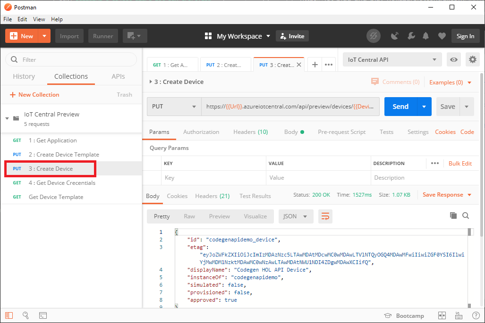
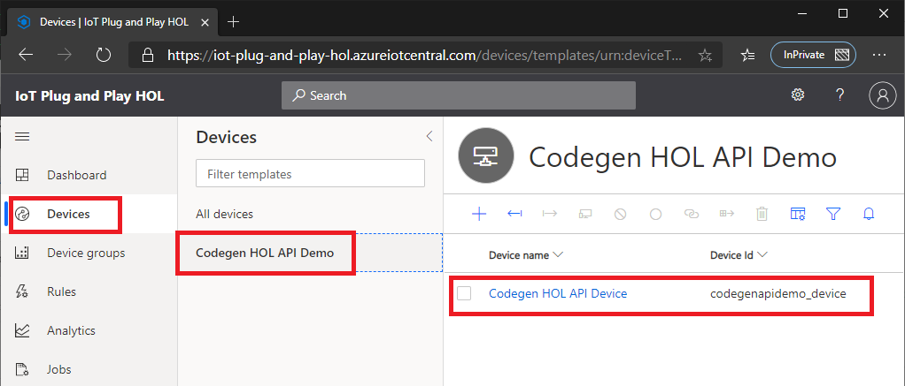
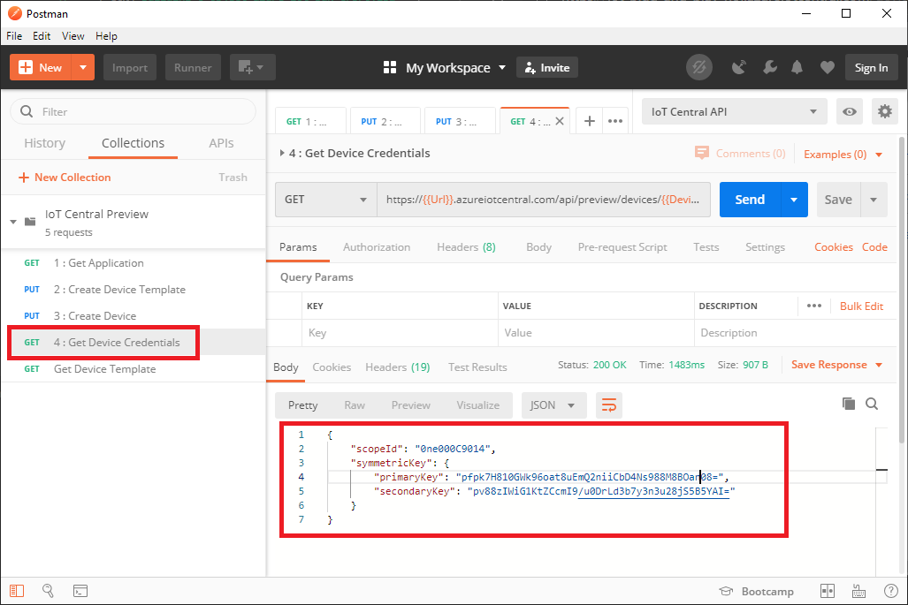
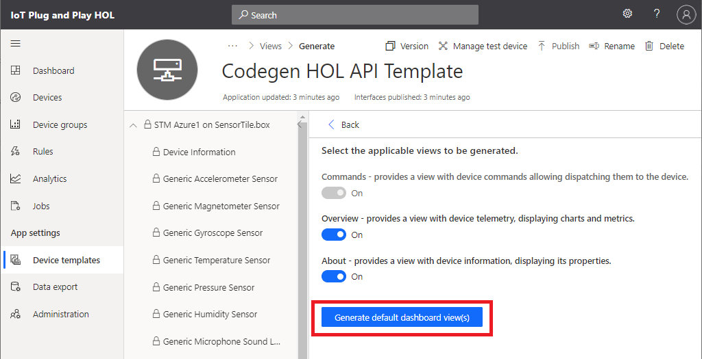
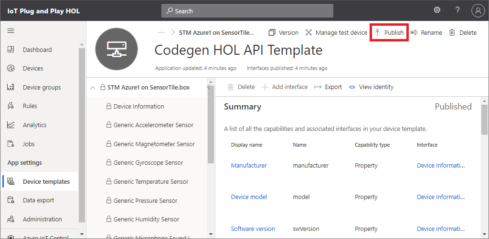
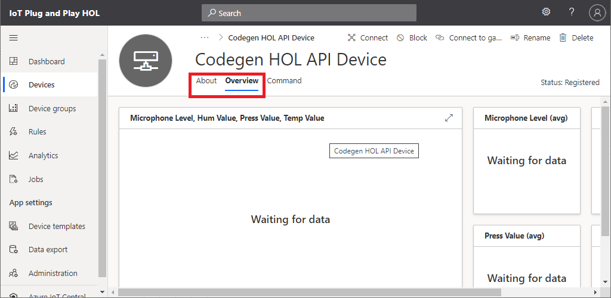

# Device Identity : RESTful API

In this section, we will create device identify in IoT Central using RESTful API with Postman to show how to use IoT Central APIs.

> [!IMPORTANT]  
> **On your development machine**  
> Make sure you configured Postman with collection and environment settings.  If you do not have `IoT Central Preview` collection and `IoT Central API` environment, go back to [Setting up Postman](IoT-PnP-Prep-Posman.md)

## Create Device Template

IoT Central creates and manages devices based on `Device Template`.  Before creating device identity, we need to create `Device Template`.
With IoT Plug and Play, IoT Central consumes Device Capability Model to create device template.

1. Browse to `Device template` page of IoT Central Application  
    At this point, there is no template

1. Switch to Postman then from `IoT Cental Preview` collection, click `2 : Create Device Template`
1. Send the request
1. Verify Rest API returns success (200 OK)
1. Browse to `Device templates` page and confirm the device template is created  

    If you do not see the new template, click `Refresh`




## Create Device Identity

Now with the device template just created, we can create a new device

1. From `IoT Cental Preview` collection, click `3 : Create Device`
1. Send the request
1. Verify Rest API returns success (200 OK)
1. Browse to `Devices` page and confirm the new device  with device id `codegenapidemo_device` is created with status `Registered`






## Retrieve device Sas Key

We have a new device identity.  Retrieve information for DPS so we can connect.

1. From `IoT Cental Preview` collection, click `4 : Get Device Credentials`
1. Send the request
1. Verify Rest API returns success (200 OK)
1. The API returns `Scope ID` and `Sas Keys`



1. Use these device connection information with the device app to connect to IoT Central

    > [!TIP]  
    > Device ID is in the response data of `3 : Create Device` API  
    > if you used the template, the id is `codegenapidemo_device`

    Example :  

    ```bash
    ./codegen1 codegenapidemo_device 0ne000C9014 pfpk7H810GWk96oat8uEmQ2niiCbD4Ns988M8BOan***
    ```

1. Once the device app successfully connected to IoT Central application, the device status will change to `Provisioned`


## Add a View to IoT Central

The template does not provide views (graphs etc) by default.  Let's add a new view to the template.
IoT Central can generate `Default view` based on DCM.  You can customize views based on your needs as well.

1. Navigate to `Device templates` view
1. Click on `Codegen HOL API Demo`
1. Select `View` then click `Generate default views`  

    

1. Click on `Generate default dashboard view(s)`

    

1. Click on `Publish` for the change to take effect  

    

1. Navigate to the device page.  Now you should see `About` and `Overview` tabs  

    

## Complete

You just created a new device and successfully connected to IoT Central using RESTful API.
