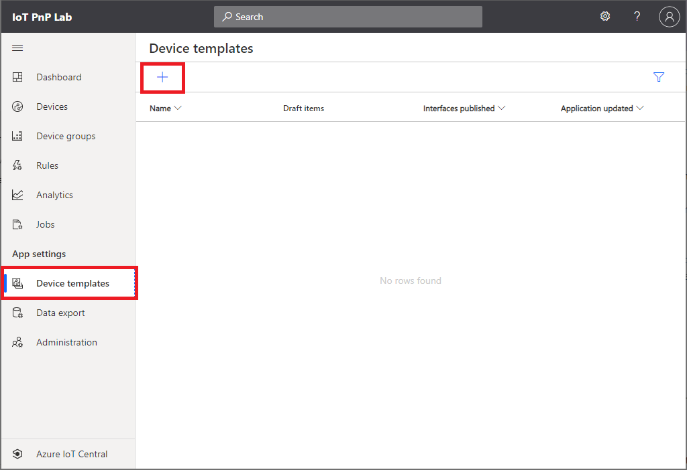
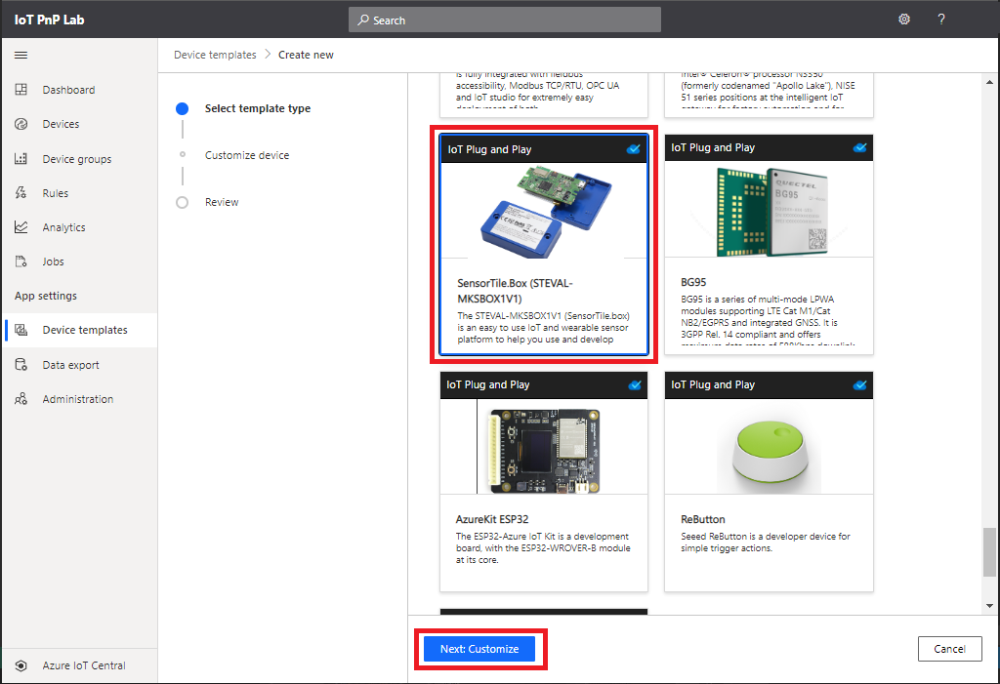
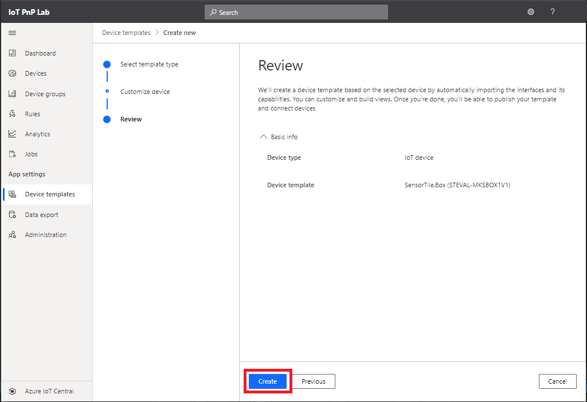
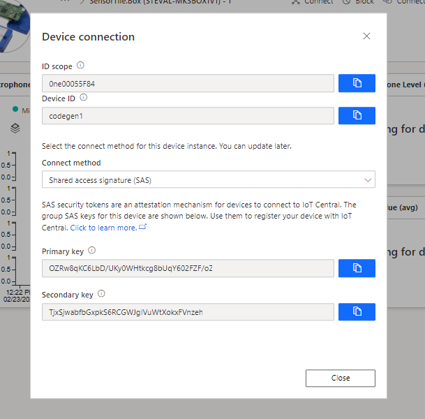
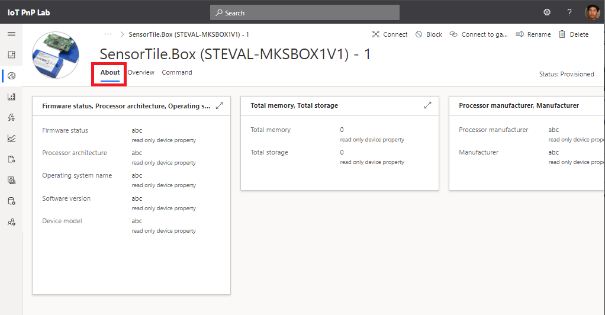

# Device Identity : Manual Method

This method is more traditional approach.  IoT solution owner creates device identities before the solution accept new devices.  
With this, The IoT solution owner has more control over which devices to be a part of the solution.

## Manually Create device identity for IoT Plug and Play devices in IoT Central

1. Open [IoT Central application](https://apps.azureiotcentral.com/myapps)
1. Select your IoT Central application
1. Select `Device templates`
1. Click on `+` sign

    

1. Scroll down and select `SensorTIle.Box(STEVAL-MKCBOX1V1)` from IoT Plug and Play pre-certified device list  
1. Click `Next Customize`  

    

1. Click `Create`

    

1. Open `Devices` pane, select `SensorTIle.Box(STEVAL-MKCBOX1V1)`, then click `+ New`  

    

1. Change `Device ID` and `Device Name`, or you can accept default names, then click `Create`  

    

1. Confirm the new device identity is in the devices list  

    

1. Open the device by clicking `Device Name`  

    

1. Click `Connect`  

    > [!NOTE]
    > Check the status of device is **Registered**  

    

1. Use `ID scope`, `Deivce ID`, and `Primary key` to run the app on RP4
    
    > [!IMPORTANT]  
    > **In VSCode with Remote Connection to RP4**

      

    Example :  

    ```bash
    ./codegen1 codegen1 0ne00055F84 OZRw8qKC6LbD/UKy0WHtkcg8bUqY602FZF/oZd*/-/-*/*
    ```

Within a few minutes, you should see :

- Telemetry (all zeros) 
- Property values `abc`
- Status is now `Provisioned`
- You can send a command from Cloud  




Press `CTRL +  C` to exit app on RP4

## Complete

You went through manual operation of creating and managing device templates and device identities.
Let's perform the same operation with API.

[Next Section](IoT-PnP-Prep-Posman.md)

[Go back to top page](readme.md)