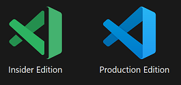
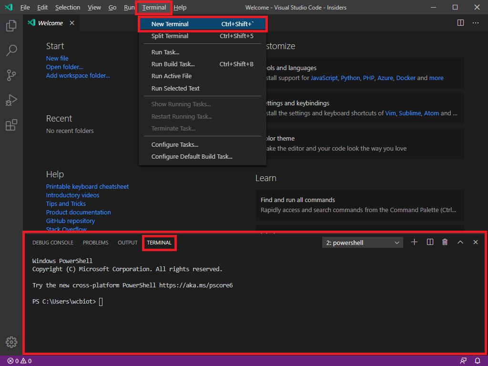
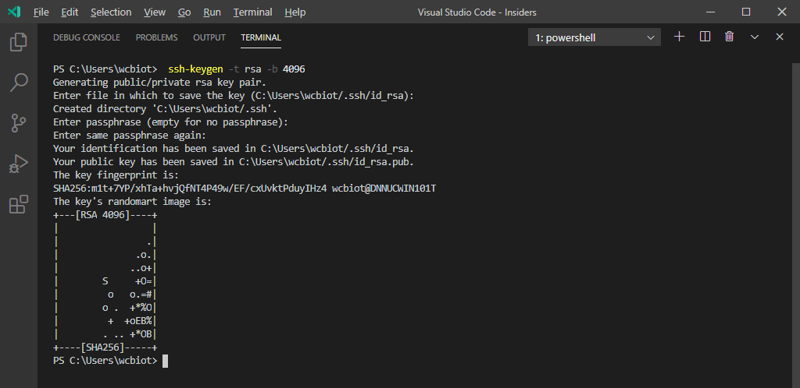
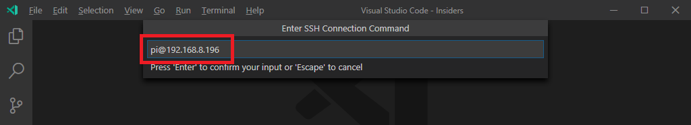
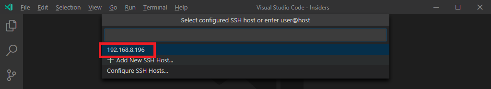
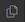
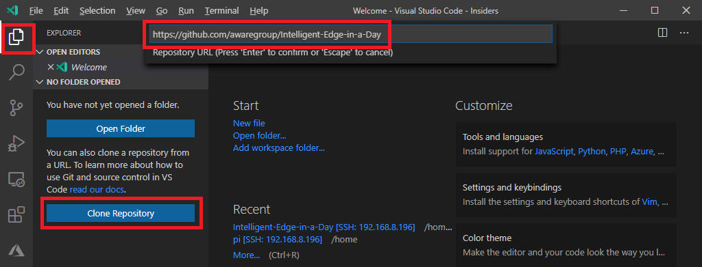

# Prep for IoT PnP

## Requirements

- Windows 10 or Windows Server 2019 1809 or above
- Postman or Curl
- Git client

## Setup your development environment

1. Install [Git](https://git-scm.com/downloads)  
    You may use your favorite Git client software
1. Install [Postman](https://www.postman.com/downloads/)
1. Install [Visual Studio Code Insiders Edition](https://code.visualstudio.com/insiders/)
1. Install OpenSSH to your Windows machine from **Windows Powershell (Admin)** with :  

    ```powershell
    Add-WindowsCapability -Online -Name OpenSSH.Client~~~~0.0.1.0
    ```

    Example :

    ```powershell
    PS C:\> Add-WindowsCapability -Online -Name OpenSSH.Client~~~~0.0.1.0

    Path          :
    Online        : True
    RestartNeeded : False
    ```

## VSCode Extensions

We will use several extensions.  Please install following extensions.

> [!TIP]  
> If you already have Production version of (Not Insiders) Visual Studio installed, please make sure you install the extension to Visual Studio Insiders Edition  
> The Insiders edition has Green Icon while production version has blue icon  
>   

- [Remote SSH (Nightly)](https://marketplace.visualstudio.com/items?itemName=ms-vscode-remote.remote-ssh-nightly)  
- [Azure IoT Device Workbench](https://marketplace.visualstudio.com/items?itemName=vsciot-vscode.vscode-iot-workbench)

1. Start VSCode Insiders Edition
1. Open new terminal from [Terminal] Menu -> `New Terminal`  

    You will see new terminal window in the bottom of screen
    

1. From the Terminal Window, install extensions with :  

    ```bash
    code-insiders --install-extension ms-vscode-remote.remote-ssh-nightly --install-extension vsciot-vscode.vscode-iot-workbench
    ```

    

1. Load Extension  

    Open `Command Palette` by pressing `F1` key, then select `Developer: Reload Window`

    

1. Verify extensions are installed in `Extensions` pane  

    

### Set up SSH Key

This is optional but highly recommended so you do not have to enter passwords repeatedly

1. Generate SSH Key from VSCode terminal window with :

    - Accept the default location (C:\Users\[User Name]/.ssh.id_rsa)
    - Optional : Enter password, or leave blank (Just `enter` key)

  ```ps
  ssh-keygen -t rsa -b 4096
  ```

  Example :

  
  
1. Copy SSH Key to RP4
    
    Replace `[RP4 IP Address]` with IP address of your RP4, then run following commands
    
    When you are prompted for password, enter `raspberry` (case sensitive)

    ```dos
    $REMOTEHOST="pi@[RP4 IP Address]"
    scp "$env:USERPROFILE\.ssh\id_rsa.pub" "${REMOTEHOST}:~/tmp.pub"
    ssh "$REMOTEHOST" "mkdir -p ~/.ssh && chmod 700 ~/.ssh && cat ~/tmp.pub >> ~/.ssh/authorized_keys && chmod 600 ~/.ssh/authorized_keys && rm -f ~/tmp.pub"
    ```
    
    Example :  
    
    
    
    If you are using macOS/Linux, copy SSH key with :

    ```bash
    ssh-copy-id pi@[RP4 IP Address]
    ```

### Add Raspberry Pi 4 to Host Configuration

You can add Raspberry Pi 4 to the list of know hosts.  This is a convenient feature so you can simply select (vs. enter IP address repeatedly) to connect to RP4

1. Click  in the bottom left corner of VSCode window
1. Select `Remote-SSH: Connect to Host...`  

    

1. Select `+ Add New SSH Host...`  

    

1. Enter `pi@[IP Address of your RP4]`, then press `enter` key

    

1. Press `Enter` to accept default configuration file  

    

1. Click `Connect` to connect to RP4  

    

### Connect to Raspberry Pi 4

After registering RP4 to configuration file, you can connect to RP4 by selecting from menu

1. Click  in the bottom left corner of VSCode window
1. Select `Remote-SSH: Connect to Host...`  

    

1. Select IP Address of your RP4 from the list  

    

1. Click `Allow access` on Windows Security Alert Popup

    

1. VSCode shows which host you are connected in the left bottom corner  

    

## Open the Lab Contents folder in VSCode

RP4 is prepared with the lab contents repo.  The repo is cloned to `/home/pi/Intelligent-Edge-in-a-Day` folder

1. From `Explorer` pane, select `Open Folder`  
  If you do not see this menu, select `Open Folder...` menu from `File` menu

    

1. Select `Intelligent-Edge-in-a-Day` from the list, then click `OK` or press `Enter` key

    

## Pull the latest contents

Please pull the latest contents from git with :

1. Select `Source Control` pane
1. Click on `...` to display menu
1. Select `pull`

    

## Clone Repository to your Development Machine

Clone lab contents from Github to your development environment

1. Start VSCode Insider
1. Open local folder  
    If you are still connected to RP4, disconnect from it
    
1. In VSCode, click on `Clone Repository` button  
    If you do not see `Explorer` pane, click on  button on the top left corner
1. Enter URL in the command palette

    ```bash
    https://github.com/daisukeiot/IoT-Plug-and-Play-WS
    ```

1. Press `enter` key  
    
1. Select path where you want to clone the repo  
    This lab assumes you clone to `C:\Repo`

    

1. Click Open for the prompt  
    

## Complete

Your development environment is ready for the rest of lab.

Start [next lab](IoT-PnP-CodeGen.md)

## Reference

> [!TIP]  
> F1 key is the short cut key to display the command pallette  
> Other shortcut keys
> - [Windows Keyboard Shortcuts](https://code.visualstudio.com/shortcuts/keyboard-shortcuts-windows.pdf)
> - [macOS Keyboard Shortcuts](https://code.visualstudio.com/shortcuts/keyboard-shortcuts-macos.pdf)
> - [Linux Keyboard Shortcuts](https://code.visualstudio.com/shortcuts/keyboard-shortcuts-linux.pdf)